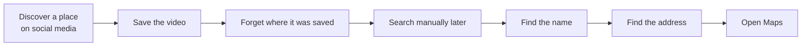
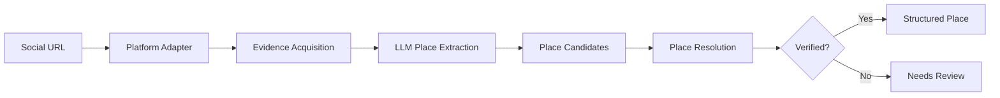
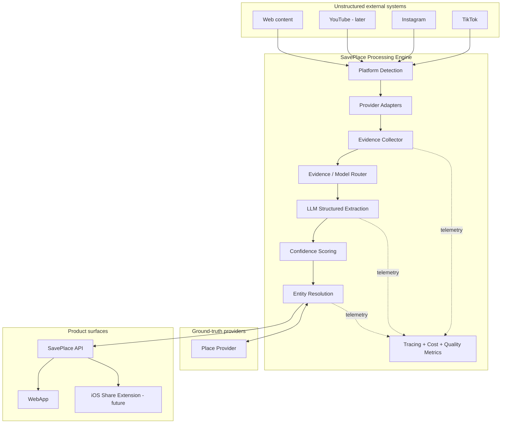
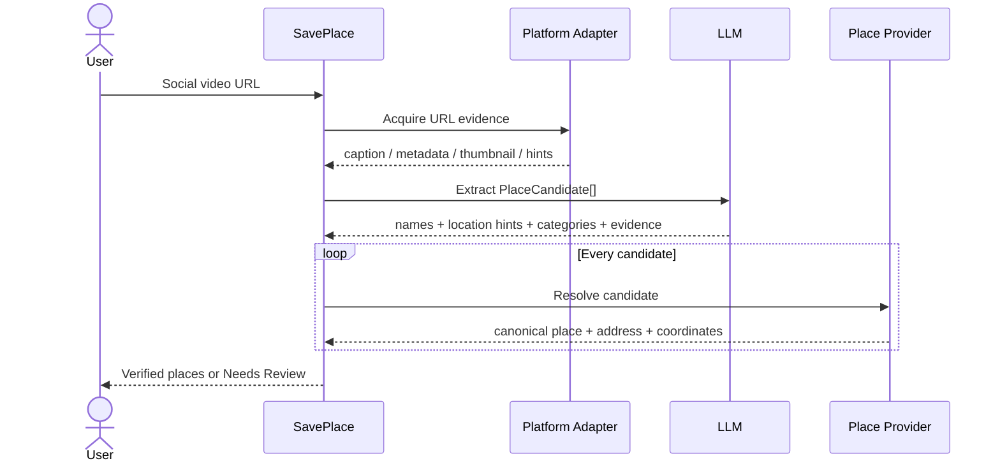
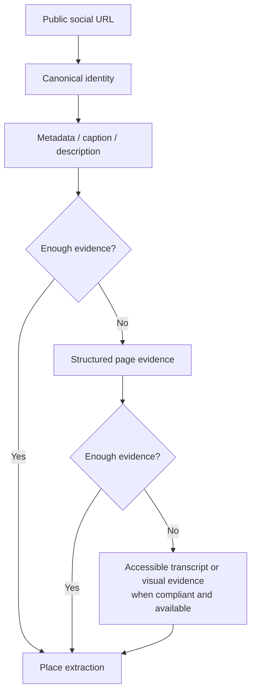
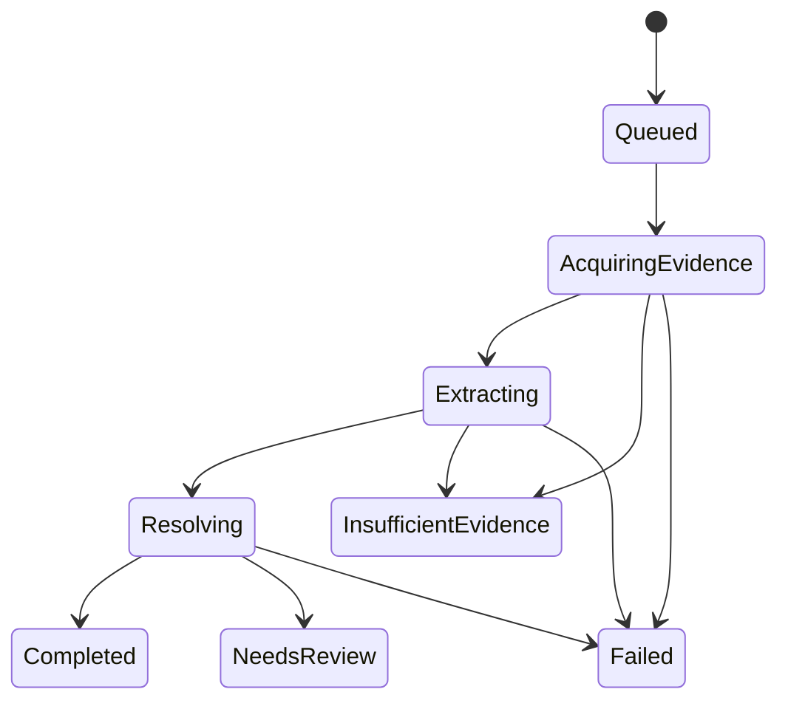
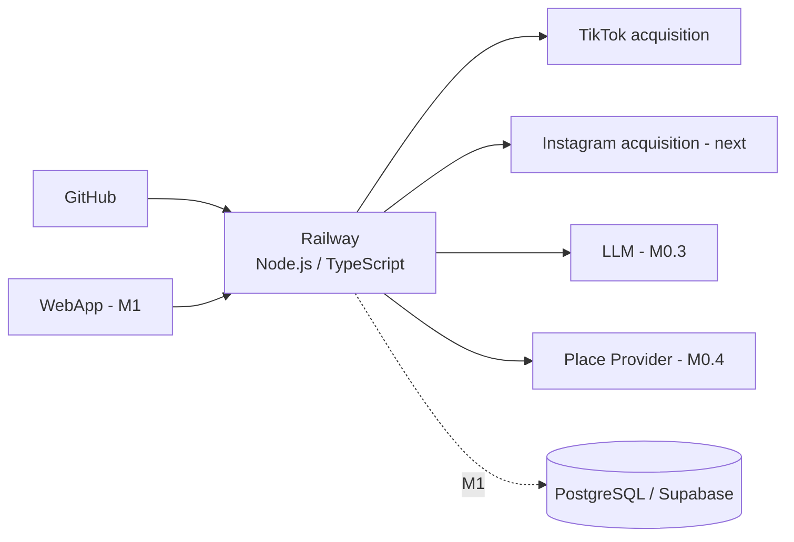
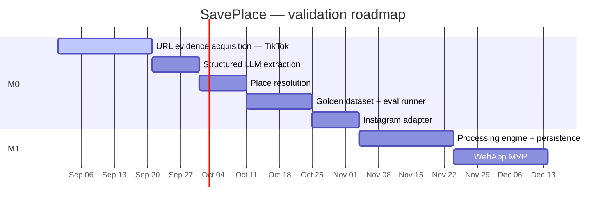

<p align="center">
  
</p>

<p align="center">
  <strong>Turn social videos into places worth visiting.</strong><br/>
  An open-source AI ingestion and entity-resolution system that transforms unstructured social-media URLs into verified, structured geographic data.
</p>

<p align="center">
  <code>AI Engineering</code> · <code>FDE</code> · <code>LLM</code> · <code>Entity Resolution</code> · <code>Structured Outputs</code> · <code>Evals</code> · <code>Observability</code>
</p>

> **Project status:** early AI spike (M0). TikTok is the first validation target, Instagram follows, and YouTube is intentionally deferred. The repository is being built in public as an AI Engineering / Forward Deployed Engineering portfolio project.

## The problem

Great restaurants, cafés, hotels, beaches, museums and experiences are discovered every day through short-form social content. The information is useful, but the medium is not designed to become a structured travel or food library.

A typical flow today looks like this:



SavePlace turns that fragmented workflow into a single operation: **paste or share the URL and receive trustworthy place data**.

## What SavePlace does

The product receives a public social-media URL, acquires the cheapest legitimate evidence available from that source, uses an LLM to identify possible places, validates those candidates against an external place provider, and returns structured results.



The key design rule is intentionally strict:

> **The LLM may identify a place. It may never be the source of truth for an address.**

Addresses, coordinates and canonical place identities must be validated by a place-resolution provider before SavePlace treats them as verified data.

## Example

A user pastes a TikTok or Instagram URL. SavePlace should eventually return something equivalent to:

```json
{
  "name": "Tan Tan",
  "category": "FOOD",
  "subcategory": "Japanese",
  "address": "Rua Fradique Coutinho, São Paulo",
  "city": "São Paulo",
  "country": "Brazil",
  "latitude": -23.0,
  "longitude": -46.0,
  "providerPlaceId": "provider-id",
  "extractionConfidence": 0.96,
  "resolutionConfidence": 0.99,
  "verified": true
}
```

The values above illustrate the output contract, not a production result.

## Why this is an AI Engineering / FDE project

SavePlace is deliberately more than an LLM wrapper. The interesting engineering problem is connecting an unreliable, unstructured external world to a reliable product contract.



This makes the project a practical playground for the skills expected from Forward Deployed and AI Engineers: external-system integration, ambiguous data, structured outputs, model routing, deterministic validation, human-in-the-loop workflows, evals, observability, reliability and cost-aware inference.

## Where the LLM belongs

The model is used for **semantic interpretation**, not for facts that can be verified deterministically.



A future progressive inference strategy will prefer cheap evidence first and only escalate when the expected quality gain justifies additional latency or cost.

## URL-only by design

SavePlace does **not** require users to upload social videos. The URL is the product input.

The evidence pipeline is designed to progress approximately as follows:



If the available evidence cannot support a reliable candidate, the correct result is `insufficient_evidence` — not a hallucinated place and not a request to upload the video.

## WebApp — MVP concept

The first product surface is intentionally small. It exists to validate the processing engine rather than hide it behind a large product build.

### 1. URL input

```text
┌──────────────────────────────────────────────────────────────────────┐
│  ◈ SavePlace                                             GitHub  ●  │
│                                                                      │
│                                                                      │
│                 Turn social videos into                             │
│                   places worth visiting                             │
│                                                                      │
│       Paste a TikTok or Instagram URL and let SavePlace             │
│       identify and verify the places mentioned in the video.        │
│                                                                      │
│   ┌──────────────────────────────────────────────────────────────┐   │
│   │ https://vt.tiktok.com/...                      Find Places → │   │
│   └──────────────────────────────────────────────────────────────┘   │
│                                                                      │
│                     TikTok  ·  Instagram                             │
│                                                                      │
└──────────────────────────────────────────────────────────────────────┘
```

### 2. Processing

```text
┌──────────────────────────────────────────────────────────────────────┐
│  ◈ SavePlace                                                        │
│                                                                      │
│                       Finding places...                              │
│                                                                      │
│             ✓ Source identified         TikTok                      │
│             ✓ Evidence acquired                                     │
│             ◌ Extracting place candidates                           │
│             ○ Verifying locations                                   │
│                                                                      │
│             We verify addresses outside the LLM.                    │
│                                                                      │
└──────────────────────────────────────────────────────────────────────┘
```

### 3. Result

```text
┌──────────────────────────────────────────────────────────────────────┐
│  ◈ SavePlace                                         ✓ 1 place      │
│                                                                      │
│   ┌──────────────────────────────────────────────────────────────┐   │
│   │  Restaurant Name                              Verified ✓     │   │
│   │  Restaurant · Japanese                                      │   │
│   │  Pinheiros, São Paulo                                       │   │
│   │                                                              │   │
│   │  Extraction 94%            Resolution 99%                   │   │
│   │                                                              │   │
│   │  [ View on Maps ]                         [ Save Place ]     │   │
│   └──────────────────────────────────────────────────────────────┘   │
│                                                                      │
│   Source: TikTok · View original                                    │
│                                                                      │
└──────────────────────────────────────────────────────────────────────┘
```

These are product-direction wireframes, not implemented screens yet.

## Processing contract

The core pipeline is designed around explicit states rather than opaque AI success/failure.



This distinction is important operationally. `insufficient_evidence` is a valid product outcome; `failed` means the system itself failed.

## Architecture principles

1. **Precision first.** A confidently wrong place is worse than no result.
2. **Cost second.** Use progressive evidence acquisition and avoid expensive inference when cheaper signals are enough.
3. **Latency third.** Several seconds are acceptable for a save/curation workflow if they buy meaningful quality.
4. **LLMs extract candidates; providers establish geographic truth.**
5. **URL-only ingestion.** No user media upload is required by the product architecture.
6. **Provider boundaries.** Platform, LLM and place providers must remain replaceable.
7. **Observable AI.** Model, prompt version, evidence, tokens, cost, latency and confidence should be measurable.
8. **Evals before scale.** Changes to prompts, models or evidence strategies should be evaluated against a golden dataset.

## Current architecture

The project intentionally begins as a modular monolith.

```text
src/
├── domain/          # stable contracts
├── ingestion/       # platform-specific evidence acquisition
├── extraction/      # structured PlaceCandidate extraction
├── resolution/      # provider-backed place verification
├── pipeline/        # orchestration
├── cli/             # M0 developer interface
└── server.ts        # deployment probe

evals/               # real-world golden cases
tests/               # deterministic + explicit integration tests
docs/                # engineering notes and project assets
```

No microservices, Kafka, Kubernetes or unnecessary infrastructure are required to prove the product hypothesis.

## Deployment strategy

The first deployment target is a small persistent Node.js service on Railway. The objective is to validate platform acquisition from a real runtime before introducing the full WebApp.



The early goal is to keep infrastructure small and inexpensive. Cost growth should primarily come from successful product usage, not idle architecture.

## AI quality and evals

SavePlace treats evaluation as a product capability rather than a final testing phase.

The initial golden dataset will grow from 10–15 real URLs toward a broader set covering restaurants, cafés, hotels, beaches, attractions, multi-place videos and ambiguous examples.

Key quality metrics:

| Metric | Why it matters |
| --- | --- |
| Place extraction precision | Did the model identify real places rather than plausible names? |
| Place resolution accuracy | Did the candidate map to the correct real-world entity? |
| Verified address accuracy | Are persisted addresses trustworthy? |
| Category accuracy | Is the place classified correctly? |
| False-positive rate | How often does SavePlace confidently return the wrong place? |
| Manual correction rate | How often does a user need to repair the result? |
| Cost per verified place | What does useful AI output actually cost? |
| P50 / P95 processing time | What experience does the user receive? |

The target is not “100% of URLs work.” The target is: **when SavePlace says it knows the place, it should be right.**

## Roadmap



Dates express sequencing, not release commitments.

### Milestones

- **M0.2 — URL Evidence Acquisition:** make at least one TikTok URL reliably produce attributable evidence from the deployed runtime.
- **M0.3 — Structured Extraction:** transform evidence into validated `PlaceCandidate[]` structured output.
- **M0.4 — Place Resolution:** resolve candidates through an external geographic provider; never trust an LLM-generated address as truth.
- **M0.5 — Evals:** benchmark 10–15 real videos before broadening the architecture.
- **Instagram:** implement the second platform adapter and compare acquisition reliability.
- **M1 — Processing Engine:** persistence, tracing, prompt/model versioning, cost accounting and asynchronous processing.
- **M1 — WebApp:** URL input, processing visibility and verified result cards.
- **Later:** iOS Share Extension, library, maps, visited/want-to-go state and multi-user productization.

## Current status

| Capability | Status |
| --- | --- |
| Domain contracts | 🟢 In progress |
| URL-only architecture | 🟢 Defined |
| TikTok adapter | 🟡 Validation in progress |
| Railway runtime probe | 🟡 Validation in progress |
| LLM structured extraction | ⚪ Planned — M0.3 |
| Place resolution | ⚪ Planned — M0.4 |
| Golden eval suite | ⚪ Planned — M0.5 |
| Instagram adapter | ⚪ Planned |
| WebApp | ⚪ Planned — M1 |
| iOS Share Extension | ⚪ Future |

## Tech stack

**Current:** TypeScript, Node.js, Zod, Vitest, Railway.

**Planned / provider-backed:** LLM structured outputs, external Places API, PostgreSQL/Supabase, WebApp frontend, tracing/observability and an iOS Share Extension.

Provider choices remain intentionally abstract where validation is not complete. The architecture should not become coupled to a model or API before its value is demonstrated.

## Local development

```bash
npm install
npm run typecheck
npm test
```

Analyze a supported URL through the current M0 CLI:

```bash
npm run analyze -- "https://vt.tiktok.com/..."
```

Explicit network/provider tests are kept separate from the deterministic test suite because third-party content and availability can change.

## Repository philosophy

This repository is developed in public to document not only the final implementation, but the engineering decisions behind it: what failed, what evidence was available, why a provider was chosen, where deterministic validation replaces AI, and how quality/cost trade-offs evolve.

That is intentional. Real AI engineering is not only about selecting a model; it is about building a reliable system around uncertain models and external systems.

## Contributing

SavePlace is open source and currently experimental. Issues, architecture discussions, provider experiments, eval cases and implementation contributions are welcome as the core pipeline stabilizes.

Please avoid committing API keys, authentication tokens, copyrighted media, or private social content. Test cases should use public URLs and store only the minimum evidence required by the eval.

## License

A license has not yet been finalized. Before accepting external contributions, the project should adopt an explicit open-source license (for example Apache-2.0 or MIT) and add it as `LICENSE`.

---

<p align="center">
  <strong>SavePlace</strong><br/>
  See it. Save it. Visit it.<br/><br/>
  Built as an open-source exploration of reliable AI systems, entity resolution and real-world FDE engineering.
</p>
